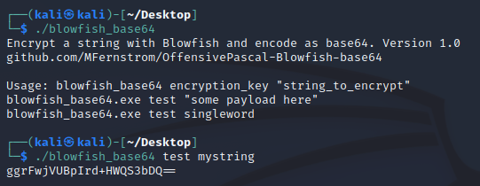

# OffensivePascal-Blowfish-base64
CLI version of https://github.com/MFernstrom/Blowfish-Base64

## Blowfish + Base64

Encrypt a text with Blowfish and Base64 encode the result

Decryption example here https://github.com/MFernstrom/Blowfish-Base64/tree/main/examples

Built in FreePascal, tested on Windows x64 and Linux x64
